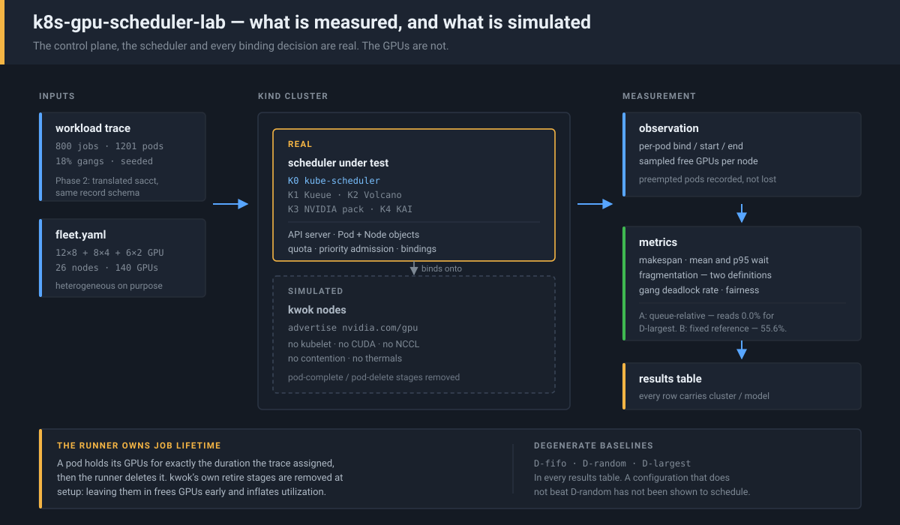

# k8s-gpu-scheduler-lab

**A controlled comparison of Kubernetes GPU schedulers on the same workload
traces.** Slurm and Kubernetes solve the same problem — allocating scarce
accelerators across competing jobs — with different mechanisms. Nobody has
published a controlled comparison of the Kubernetes options on an identical
trace. That comparison is the product.

> **Phase 1 of 3.** The substrate, the workload generator, the metrics, the
> degenerate baselines, and K0. Kueue, Volcano, NVIDIA's bin-packing and
> KAI/DRA are not built yet, and their rows in the results table are empty.
> Published as it is built.

<p align="center">
  
</p>

---

## The thesis

Slurm splits nothing: multifactor priority plus EASY backfill, one controller,
one policy. Kubernetes splits the same job across projects — [Kueue][kueue] does
quota and admission, [Volcano][volcano] does gang scheduling and DRF fairness,
NVIDIA's [KAI][kai] does topology-aware gang scheduling with DRA. Each is
benchmarked, when at all, against the default scheduler on its own chosen
workload.

Two claims motivated this repo, and neither is currently checkable:

- **NVIDIA's enhanced Volcano bin-packing was reported at KubeCon EU 2026 to cut
  GPU node fragmentation by 34% versus the default scheduler.** No public
  independent reproduction exists. Neither does a public statement of how
  fragmentation was defined — and as [docs/metrics.md](docs/metrics.md) shows,
  the choice of definition moves the number by tens of points.
- **Gang scheduling is assumed to be strictly better for multi-node training.**
  It has a cost — held-but-idle GPUs while a gang assembles — that is rarely
  measured alongside the benefit.

This lab is the apparatus for checking both. **If the 34% does not reproduce,
that is the finding and it gets published as the finding.**

## What kwok can and cannot tell you

Read this before any number below.

Every "GPU node" here is a [kwok][kwok] node: an API object with no kubelet
behind it, advertising `nvidia.com/gpu` it does not have. **The control plane is
real, the scheduler is real, and every binding decision is real. Nothing else
is.**

**This lab can measure:** placement decisions, queue wait, admission order,
packing and fragmentation, gang-admission behaviour, quota and preemption
effects, and scheduler throughput under queue pressure.

**This lab cannot measure — at all:**

- NCCL or collective-communication performance. No traffic is sent.
- Real GPU contention, MPS/MIG sharing behaviour, or memory pressure.
- Thermal behaviour, throttling, or power.
- Network topology effects, including whether a topology-aware placement was
  actually *better* — only whether the scheduler produced it.
- Anything depending on wall-clock, because time is compressed (see below).
- Kubelet-side failures: image pulls, admission webhooks, device-plugin faults.

A scheduler that wins here has been shown to make better *decisions* on this
trace. It has not been shown to make jobs faster. Those are different claims and
this repo can only support the first.

**Time is compressed.** An eleven-hour trace is replayed in minutes by dividing
every timestamp by `--speedup` (default 60). Scheduling decisions are not
time-dependent at this resolution, but leases, backoff ceilings and controller
resync periods are — so this lab cannot see them.

## Configurations

| id | scheduler | status |
|---|---|---|
| **K0** | default `kube-scheduler` + device plugin | **built** |
| K1 | + Kueue (quota, admission) | planned |
| K2 | + Volcano (gang, DRF) | planned |
| K3 | + NVIDIA enhanced Volcano bin-packing | planned — this is the 34% claim |
| K4 | NVIDIA KAI + DRA | planned |
| S0 | Slurm, via [slurm-scheduler-lab][ssl] on the same trace | planned — cross-substrate control |
| D-fifo | oldest-first, first-fit | **built** (degenerate) |
| D-random | random pod order, random node | **built** (degenerate) |
| D-largest | largest request first | **built** (degenerate) |

**The degenerate baselines are not filler.** A configuration that does not
clearly beat `D-random` has not been shown to schedule. The convention comes
from [slurm-rca-bench][rca], where a degenerate agent that reads no telemetry
sets the floor every real agent has to clear. If a real scheduler barely beats
FIFO here, the correct response is a harder trace — never a softer metric.

## Results

### Run 2 — 800 jobs / 1201 pods, 140-GPU heterogeneous fleet, seed 0

| config    | src     | makespan h | util % | GPU-h used | mean wait | p95 wait | frag A | frag B | gang DL | fair |
|-----------|---------|------------|--------|------------|-----------|----------|--------|--------|---------|------|
| K0        | cluster | 18.5       | 54.2%  | 1404.7     | 173m      | 559m     | 17.4%  | 51.9%  | 38.1%   | 1.00 |
| D-fifo    | cluster | 15.3       | 65.6%  | 1404.7     | 283m      | 544m     | 15.9%  | 63.2%  | 58.3%   | 1.00 |
| D-random  | cluster | 20.8       | 48.3%  | 1404.7     | 256m      | 678m     | 22.4%  | 57.9%  | 92.8%   | 1.00 |
| D-largest | cluster | 18.5       | 54.4%  | 1404.7     | 396m      | 618m     | 0.0%   | 55.6%  | 46.0%   | 1.00 |

Measured on a real control plane (kind + kube-scheduler); `src=cluster` on every
row. Pinned versions in [cluster/upstream.lock](cluster/upstream.lock).
`GPU-h used` is identical across configurations by construction — every job
completes, so delivered GPU-hours are fixed by the trace and **makespan is the
quantity that actually varies**. Utilization is a restatement of it.

**Read these numbers with three caveats, in this order.**

**1. Run-to-run variance is larger than most of the differences in the table.**
The same K0 configuration, same trace, same seed, run twice, gave 33.7% and
54.2% utilization (29.8 h and 18.5 h makespan). The trace is deterministic; the
harness is not, because the replay is driven by real wall-clock and API latency
feeds back into the simulated clock. **Do not quote an absolute number from this
table.** Only differences that survive repetition mean anything, and Phase 2
must report a spread rather than a point estimate.

**2. K0 and the degenerate baselines are not measured through equal machinery.**
`kube-scheduler` runs its own queue with exponential backoff on unschedulable
pods and binds one pod at a time. The degenerate policies are bound by an
in-process loop with global visibility of every pending pod on every pass and no
backoff at all. That asymmetry flatters the degenerate baselines on makespan,
and it is a property of this harness rather than of the schedulers. The
comparison that will be fair is K1–K4, which are all real schedulers measured
the same way as K0.

**3. Nothing here has tested the claim the repo was built for.** K3 is
unimplemented. The 34% fragmentation figure remains unreproduced.

**What is worth noticing anyway**, because it held across both runs:

- **`D-largest` reports 0.0% fragmentation under definition A** and 55.6% under
  definition B, on the same data. The artefact reproduces on a real cluster
  exactly as it does in the reference model — which is the concrete argument
  that an unstated fragmentation definition is not a measurement.
- **`D-random` deadlocks 92.8% of gangs** (95.7% in run 1), against 38.1% for
  K0. Random placement almost always splits a gang. This is the metric that
  should separate a gang-aware scheduler from one without gang support, and it
  is clearly alive.
- **K0 has the best mean wait of the four** (173 min) while finishing later than
  `D-fifo`. It is ordering work well and draining slowly — consistent with the
  backoff asymmetry in caveat 2, and the first thing K1 (Kueue) should change.

Kueue, Volcano, NVIDIA bin-packing, KAI/DRA and the Slurm control are not built.
Their rows do not exist yet rather than being empty, which is the honest way to
show an unbuilt comparison.

## Metrics

Defined in full, with formulas, in [docs/metrics.md](docs/metrics.md).
Limitations are in [docs/limitations.md](docs/limitations.md).

The one to read first is fragmentation, which is reported under **two**
definitions because they disagree:

- **A — queue-relative.** Free GPUs on nodes that cannot fit the *smallest
  currently-pending* pod.
- **B — queue-independent.** Free GPUs on nodes that cannot fit a fixed
  reference request (the largest per-pod ask in the trace).

Definition A reports **0.0%** for `D-largest` (0.003% before rounding), which
sounds like flawless packing and is an artefact: largest-first starves small
jobs, so a 1-GPU pod is essentially always pending, so the smallest pending
request is 1, so no free GPU is ever "unusable". Under definition B the same run
reads **49.4%** — four orders of magnitude apart, on identical data. Any published
fragmentation number that does not state its definition is not comparable to
anything, including the 34% claim this repo exists to test.

## Quickstart

No GPUs. No cloud account. One command each.

```bash
make up      # kind cluster + kwok + the simulated fleet
make bench   # replay the trace against every built configuration
make down    # tear it all down
```

Everything is pinned in [cluster/upstream.lock](cluster/upstream.lock).
Scheduler behaviour moves across minor versions, so an unpinned benchmark is
not a benchmark. `verified` in that file records whether a green run has
actually been observed on the pinned combination.

To score the degenerate policies without a cluster at all:

```bash
make bench-model
```

Rows produced that way are labelled `model` rather than `cluster` in every
table, and must never be compared against a cluster row.

## The fleet

Deliberately heterogeneous — 12x8 + 8x4 + 6x2 GPU nodes, 140 GPUs total.
Fragmentation is only measurable when nodes have different shapes; on a fleet of
identical nodes there is nothing for a job to fail to fit into.
`fleets/homogeneous.yaml` is the control that should report near-zero
fragmentation, and if it does not, the metric is wrong.

## Layout

```
cluster/       kind config and the upstream version lock
fleets/        fleet definitions (node classes, GPU counts)
src/k8slab/    fleet loader, trace generator, policies, runner, metrics
docs/          metric definitions and limitations
tests/         unit tests; no cluster required
```

## Related

- [slurm-scheduler-lab][ssl] — the Slurm side. Same trace vocabulary; S0 will
  use it as the cross-substrate control.
- [slurm-rca-bench][rca] — where the degenerate-baseline and
  measured-versus-asserted conventions come from.

## License

MIT.

[kwok]: https://kwok.sigs.k8s.io/
[kueue]: https://kueue.sigs.k8s.io/
[volcano]: https://volcano.sh/
[kai]: https://github.com/NVIDIA/KAI-Scheduler
[ssl]: https://github.com/Zhanyl-tech/slurm-scheduler-lab
[rca]: https://github.com/Zhanyl-tech/slurm-rca-bench
